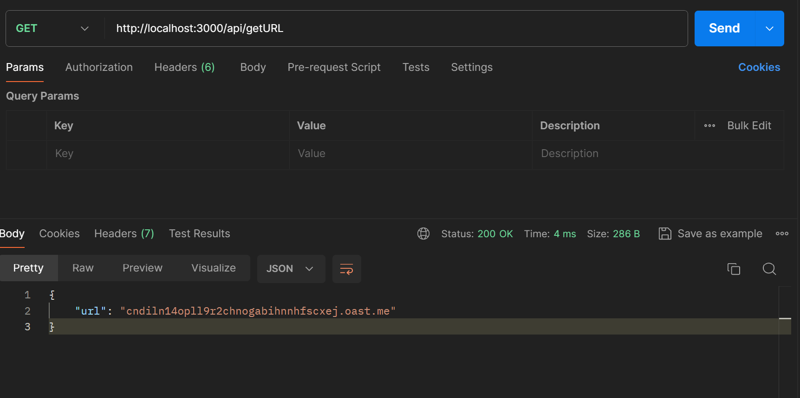
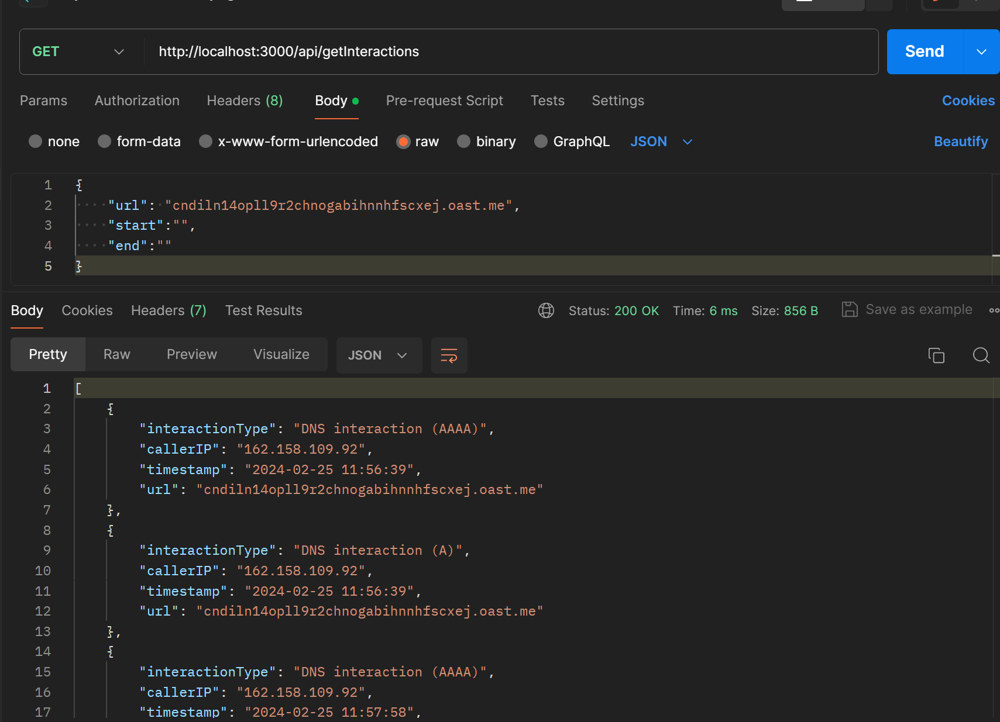

# Interactsh-Wrapper

This repository contains a wrapper service for Interactsh, designed as Task 2, which defines building a wrapper service with specific endpoints.

## APIs:

1.  **api/getURL**:
    
    Description: This endpoint provides the URL of the testing server being used for the current session in Interact.sh.
    Endpoint: /api/getURL
    
    Method: GET
    
    Example Response:
    {
    "url": "https://uddh82b6bdnfgdydbdbsbn3.oast.live"
    }

    
    
2.  **api/getInteractions**:
    
    Description: This endpoint takes the URL of the testing server and sends information about its interactions, including caller IP and timestamp.
    Optional: This endpoint can also take timestamp limits to only provide information about interactions within the given timestamp range.
    Method: GET
    
    

## Setup Instructions:

To set up and run this wrapper service, follow these steps:

1.  Clone the repository:
    
    bash
    
    `git clone https://github.com/vishalqw78/Interactsh-Wrapper.git`
    
2.  Install dependencies:
    
    `npm install`
    
3.  Run the service:
    
    `node index.js`
    

Make sure to replace `vishalqw78` with your actual GitHub username if you forked this repository.
